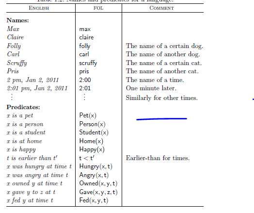
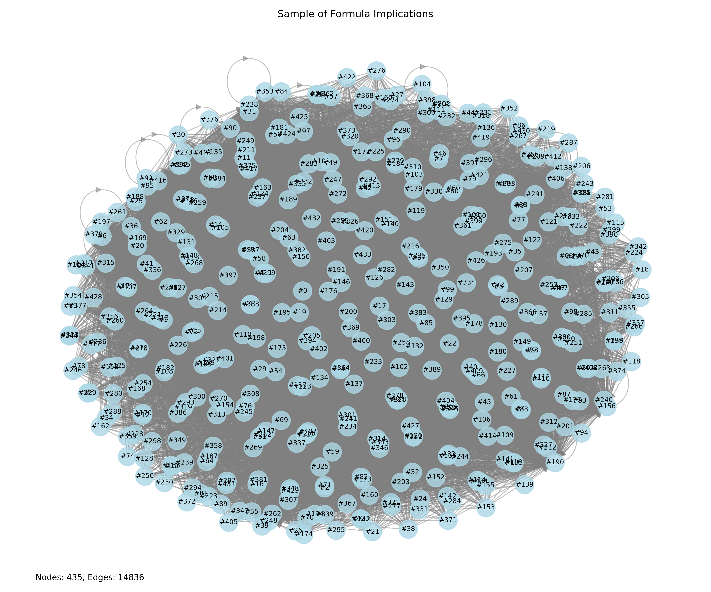
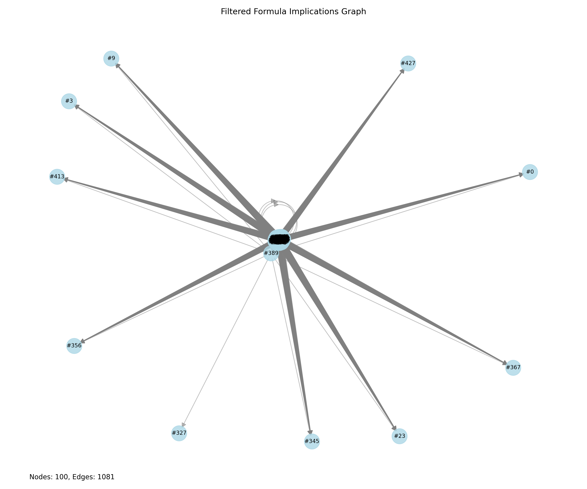

# Computability and Logic Project Writeup

## Problem Description

The goal of Exercise 11.21 from the *Language, Proof and Logic* (LPL) textbook is to translate English sentences into First-Order Logic (FOL) using a fixed vocabulary. Sentence 9 presents a particularly challenging case:

<br>Above are the Predicates and variables allowed for the exercise.
> “Max fed all of his pets before Claire fed any of her pets.”  
> (Assume that “Max’s pets” are those he owned at 2:00, and the same for Claire.)

While attempting to solve this exercise, students frequently encounter issues with automated grading through GradeGrinder. The system failed to halt on **435 unique student-submitted statements**, indicating widespread confusion or ambiguity in the problem specification or in students’ understanding. This project investigates the causes of those failures, proposes ways to reduce incorrect interpretations, and outlines a formal process for addressing similar logical translation challenges.

## Investigation and Visualization

Using data from submitted answers and their logical implications, I generated a graph representing:
- Each unique student submission.
- The implications between statements (i.e., if one implies another).

This graph provides two key benefits:
1. **Hierarchical filtering:** Strong statements (those with many children) can help eliminate large branches of incorrect logic.
2. **Insight into student reasoning:** Identifying common patterns in incorrect answers reveals misunderstandings or ambiguities in predicate definitions.

This is what the graph looks like
## Predicate Filtering

The correct translation must use all of the following predicates and constants:

- `Pet`
- `Owned`
- `Fed`
- `max`
- `claire`

Eliminating submissions that omit any of these yields:
- **30% reduction** in the number of candidate statements.
- **80% reduction** in implication edges.

This initial filter simplifies further analysis considerably.

## Analysis of Representative Statements

### GradeGrinder’s Accepted Translations

Two logically equivalent FOL translations accepted by GradeGrinder are:

1.
```logic
∃t (
  ∀y ∀z (
    (Pet(y) ∧ Owned(max, y, z) ∧ Fed(max, y, z)) → z < t
  ) ∧ 
  ¬∃w (
    w < t ∧ ∃x (
      Pet(x) ∧ Owned(claire, x, w) ∧ Fed(claire, x, w)
    )
  )
)
```

2.
```logic
∃t ∀x ∀y (
  (Pet(x) ∧ Owned(max, x, 2:00) ∧ Pet(y) ∧ Owned(claire, y, 2:00)) →
  (∃u (Fed(max, x, u) ∧ u < t) ∧ ¬∃v (Fed(claire, y, v) ∧ v < t))
)
```

These formulations explicitly state that **all pets owned by Max at 2:00 were fed before any pets owned by Claire at 2:00 were fed.** The statements quantify over pets and time to ensure the appropriate ordering.

### Incorrect Submissions and Misinterpretations

#### Statement 6
```logic
∃x0 ∀x1 ∀x2 (
  (Pet(x2) ∧ Pet(x1) ∧ Owned(max, x1, 2:00) ∧ Owned(claire, x2, 2:00)) →
  (¬Fed(claire, x2, x0) ∧ Fed(max, x1, x0))
)
```
**Issue:** Assumes *simultaneous feeding* of all Max’s pets at one time, which isn’t required by the original English sentence.

#### Statement 378
```logic
∀x0 (
  ∃y1 (Pet(y1) ∧ Owned(max, y1, 2:00) ∧ Fed(max, y1, x0) ∧ 
  ∃y2 (Pet(y2) ∧ Owned(claire, y2, 2:00) ∧ Fed(claire, y2, x0)) →
  ∀x1 x0 < x1
)
```
**Issue:** Incorrectly assumes Claire *necessarily* feeds her pets.

#### Statement 23
```logic
∀x0 (
  (Pet(x0) ∧ Owned(claire, x0, 2:00)) → ¬Fed(claire, x0, 2:00)
) ∧ 
∀x0 (
  (Pet(x0) ∧ Owned(max, x0, 2:00)) → Fed(max, x0, 2:00)
)
```
**Issue:** Relies on fixed time (2:00) and assumes feeding occurred at that exact moment.

#### Statement 3
```logic
∀x0 ∀x1 (
  (Pet(x1) ∧ Pet(x0) ∧ Owned(max, x0, 2:00) ∧ Owned(claire, x1, 2:00)) →
  ∃x2 (¬Fed(claire, x1, x2) ∧ Fed(max, x0, x2))
)
```
**Issue:** Again conflates "before" with "at the same time," failing to capture strict temporal ordering.

## Attempted Automation with Theorem Provers

To expedite verification, I attempted to implement an equivalence checker using the **Z3 SMT solver**. The approach:

1. Translate student and answer statements into Z3’s logical format.
2. Use Z3 to test logical equivalence or implication.

### Outcome
While full automation proved too complex to complete in time, the attempt highlighted several deeper issues:
- Precise definitions of predicates are crucial.
- Temporal logic requires careful encoding.
- Seemingly minor syntactic differences can imply significant semantic divergences.

## Ambiguities in Predicate Definitions

### Fed Predicate
Two interpretations were observed:
1. **Point-wise feeding:** `Fed(Claire, Spot, 2:00)` means Claire fed Spot **at exactly 2:00**. (Answer key's interpretation.)
2. **Cumulative state:** Spot was fed **at or before** 2:00.

Many incorrect submissions assumed the second, leading to logical errors in ordering.

### Owned Predicate
Though generally interpreted as “owned at 2:00,” ambiguity arises when:
- Multiple people own the same pet.
- A pet being fed by one owner might affect its feeding status under another.

These issues point to a need for greater clarity in instructions and formal semantics.

## Future Work

To improve both educational outcomes and grading accuracy, I propose:
- **Clarifying predicate semantics** in the exercise prompt.
- **Developing a robust equivalence checker** using theorem provers or model checkers.
- **Visualizing countermodels or worlds** to help students debug their logic intuitively.
- **Improving generalizability** of the tool to other LPL exercises.
- **Automatically identifying common student misconceptions**, feeding insights back into instruction.

## Conclusion

The complexity of sentence 9 in Exercise 11.21 reveals a key intersection between formal logic, semantics, and pedagogy. While automated tools like GradeGrinder are invaluable, their effectiveness depends on the precision of predicate definitions and the clarity of expectations. With clearer semantics and stronger tools, we can reduce confusion and improve students’ understanding of temporal logic and quantification.
